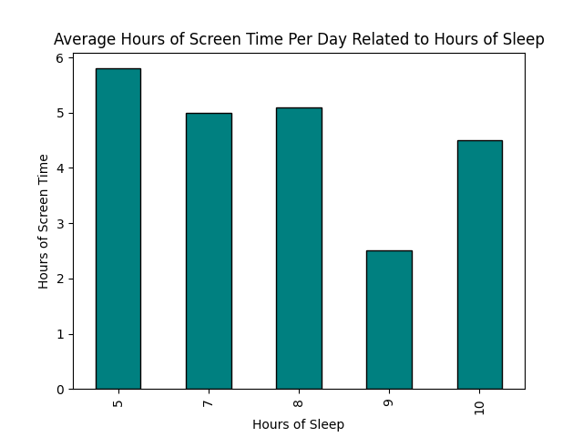
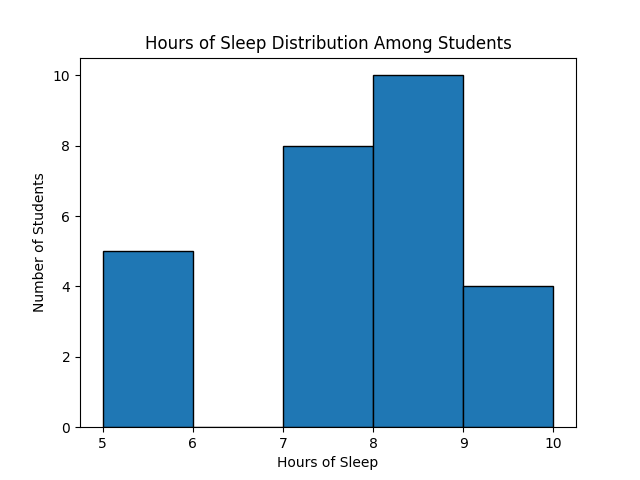
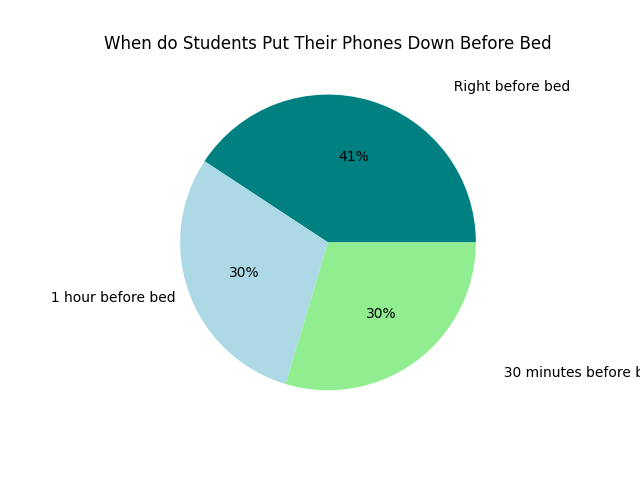

# Project 3 -  Student Submission

## Project Info
- **Project Title:** _Sleep vs Screens Data Analysis_
- **Your Name:** _Katerina Wedrychowicz_
- **Date:** _10/10/2025_

---

## Survey Information
- **Survey Topic:** _My survey is about different factors that contribute to the amount of time students spend on screens and how that affects their sleep._
- **Survey Link:** [Click here to view survey](https://docs.google.com/forms/d/e/1FAIpQLSdpozsQezG34dt62C2CJjs-9dhFDahvnl3k0F1qRdrBkKsbAg/viewform?usp=sharing&ouid=105064386441211635629)
- **Number of Responses:** _12_

---

## Survey Questions
List the questions you asked in your survey and their type:

| # | Question Text | Response Type (Multiple Choice / Numeric / Text) |
|---|---------------|-------------------------------------------------|
| 1 | _How many hours of sleep do you usually get?_ | Numeric |
| 2 | _How many hours of screen time do you have per day?_ | Numeric |
| 3 | _When do you put your phone/device down before bed?_ | _Multiple Choice_ |
| 4 | _Do you keep your phone in your room when you sleep?_ | _Multiple Choice_ |
| 5 | _Do you have a screentime limit on your phone?_ | _Multiple Choice_ |

---

## Data Overview
- **Link to Raw Data File (CSV):** [Download here](sleep_ScreensData.csv)
- **Number of Columns:** _5_
- **Number of Rows:** _28_
- **Any Cleaning Steps Taken:** _I removed brackets around the number of hours of sleep each person got, and I spaced out the column headers in order to make it easier to read and understand._

---

## Charts Created
List each chart you made, its type, and what it shows. Add a link or embed an image if possible.

| # | Chart Title | Chart Type (Bar, Histogram, Scatter, etc.) | Brief Description | Link or Image |
|---|-------------|-------------------------------------------|-------------------|---------------|
| 1 | _Average Hours of Screen Time Per Day Related to Hours of Sleep_ | Bar Chart | Shows average hours of screen time per day compared to the hours of sleep. |  |
| 2 | _Hours of Sleep Distribution Among Students_ | Histogram | Shows how many students fall into different hours of sleep ranges. |  |
| 3 | _When do Students Put Their Phones Down Before Bed_ | Pie Chart | Shows the percentages of when students put their phones down before bed. |  |

---

## Data Analysis & Insights
Write a short analysis of your findings. Include at least one interesting insight from your data.

> "I found that most students sleep around 7-8 hours per night, and those that sleep less than that also spend more time on screens during the day. I also found that the time that students put their phones down before bed is pretty evenly spread out among the values, about 40% put it down right before, 30% put it down 30 minutes before, and the remaining 30% put it down 1 hour before bed. I found it interesting that the stduents who sleep 10 hours spend a lot more time on their phones than the ones who sleep 9 hours.”

---

## Reflection
Answer briefly:
- What went well in your project? I was able to collect more than 5 pieces of real data, which made it so I didn't have to create a lot of fake data. The csv was easy to make. 
- What was the most challenging part? In order to make my data easier to read I added spaces in front of my keys, which gave me some trouble when creating the graphs and charts. 
- If you had more time, what would you do differently? I wouldn't worry about making the csv easy to read and just focus on making it easier to program with. 

---

### Submission Checklist
- [X] Link to survey included
- [X] Questions listed
- [X] Raw data file attached or linked
- [X] 3+ charts created and linked/embedded
- [X] Data analysis section filled in